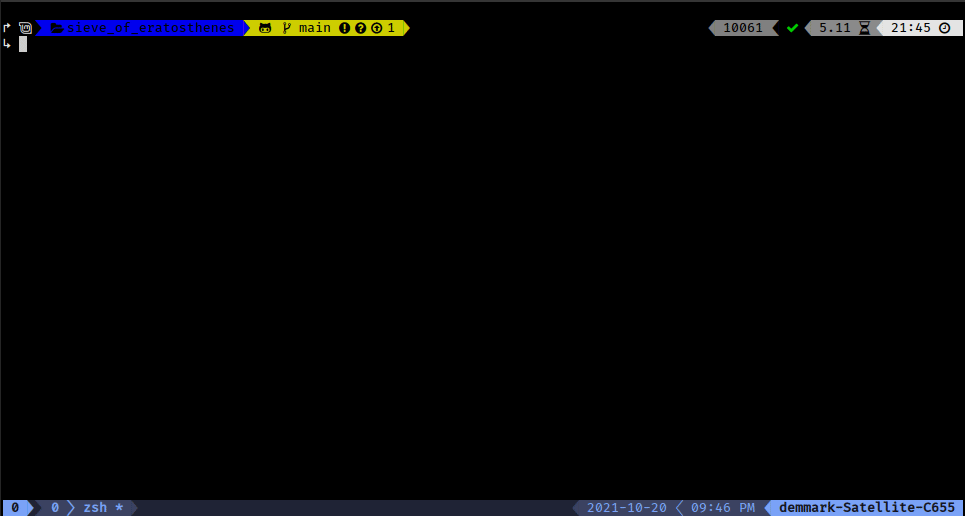

# Sieve of Eratosthenes

Finds all prime numbers up to the user specified value (less than 8,000,000)
using the sieve of Eratosthenes.

## Preview



## Installation

If you already have a recent version of Rust installed just clone this repo.

## Usage

Open your terminal in the project directory and then run the command:

```sh
cargo run 100
```

This will print the prime numbers up to 100 in the terminal.
## License

[GNU General Public License version 3](https://opensource.org/licenses/GPL-3.0)

## Leave a Star

Leave a star in GitHub.
