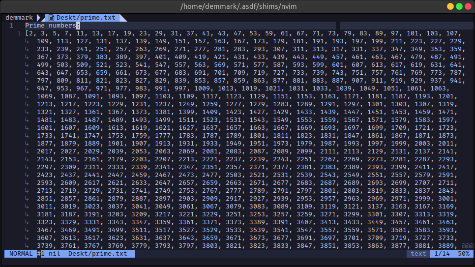
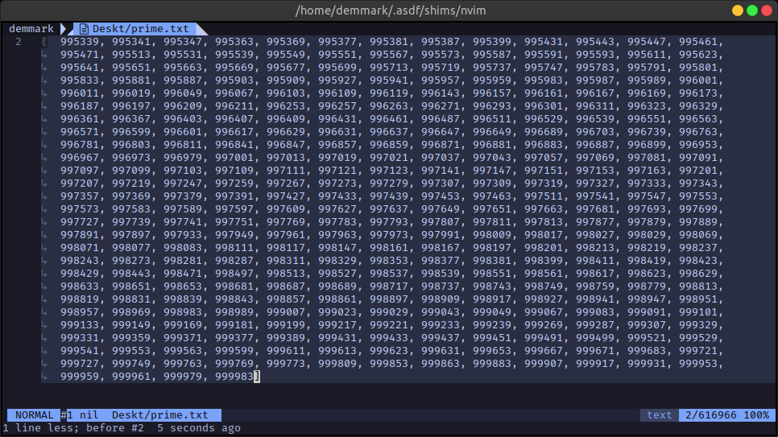

# Sieve of Eratosthenes

Finds all prime numbers less than 1,000,000 using the sieve of Eratosthenes.

## Preview




## Installation

If you already have a recent version of Rust installed just clone this repo.

## Usage

Open your terminal in the project directory and then run the command:

```sh
cargo run
```

## License

[GNU General Public License version 3](https://opensource.org/licenses/GPL-3.0)

## Leave a Star

Leave a star in GitHub.
